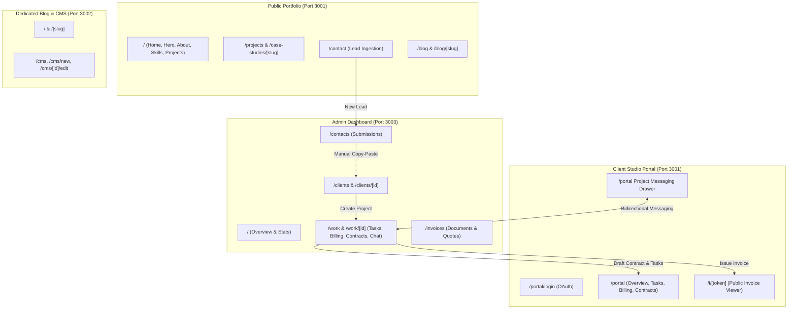
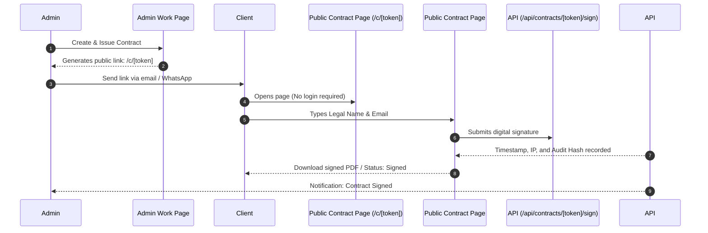

# Comprehensive UI/UX & Ecosystem Architecture Review

**Portfolio · Admin Dashboard · Blog · Client Studio Portal**  
*Codebase: `kondwanimuwowo/kondwani`*

---

## Executive Summary

The platform is designed around a powerful vision: a **unified ecosystem** bridging a public personal brand with an end-to-end freelance client operating system.



While the underlying Postgres/Drizzle data layer is well architected, the **UI/UX and cross-app connectivity currently suffer from critical friction points, broken origin/port assumptions, orphaned sections, and isolated experiences.**

---

## 1. The Cross-App Interplay: Portfolio ↔ Admin ↔ Portal ↔ Blog

The relationship between the four surfaces is where the greatest UI/UX opportunities and technical breakdown points reside.

### 1.1 The "Trapped Client Portal" Architectural Hack
* **Current Implementation:** `/portal` resides inside `app/(public)/portal/page.tsx`. `app/(public)/layout.tsx` wraps all public pages with `<SmoothScrolling>`, `<Header>`, and `<Footer>`. To hide the public header and footer, the portal dashboard uses:
  ```tsx
  <div className="fixed inset-0 z-50 bg-background text-foreground flex flex-col font-sans">
  ```
* **UI/UX Problem:**
  1. Both the public `<Header>` and `/portal` use `z-50`. On mobile viewports and dynamic address bar resize (iOS Safari / Android Chrome), fixed overlay hacks cause content clipping, jitter, and background layout thrashing.
  2. Public analytics trackers and smooth scroll wrappers continue running in the background.
  3. The client is **trapped**: the brand mark in the portal header (`[<ondwani · Client Studio Portal`) is a non-clickable `<span>`. The client has no button or link to return to the public portfolio or homepage without manually manipulating the URL bar.
* **Recommendation:** Move `/portal` into its own Next.js route group: `app/(portal)/layout.tsx` and `app/(portal)/portal/page.tsx`, completely separate from `(public)`. Give the portal its own lightweight, unpolluted shell, and make `[<ondwani` a clear navigation link back to the homepage.

---

### 1.2 Broken Port & Domain Linking Between Admin & Portal
* **Hardcoded Origin Replacements:** In `admin/app/(admin)/work/[id]/page.tsx` line 1355:
  ```tsx
  const link = `${window.location.origin.replace(":3001", ":3000")}/portal?contract=${contract.token}`
  ```
  And in `admin/app/(admin)/invoices/page.tsx` line 84:
  ```tsx
  const url = `${window.location.origin.replace(/admin\./, "")}/i/${token}`
  ```
* **The Failure:**
  1. Admin runs on port `3003`. There is no `:3001` in the origin, so it generates `http://localhost:3003/portal?contract=...` (which 404s).
  2. In production, if deployed to custom Cloudflare Worker domains (e.g. `kondwani-admin.pages.dev`), `.replace(/admin\./, "")` fails silently, leaving broken links.
  3. `NEXT_PUBLIC_SITE_URL` and `NEXT_PUBLIC_PORTAL_URL` should be strictly defined in `.env` and used uniformly.

---

### 1.3 Ignored URL Parameters in Portal
When the Admin sends an automated email notification via Resend:
```ts
const portalUrl = `${process.env.NEXT_PUBLIC_PORTAL_URL ?? "https://kondwanimuwowo.com/portal"}?project=${projectId}`
```
Or when copying a contract link: `.../portal?contract=${contract.token}`:
* **The Failure:** `app/(public)/portal/page.tsx` **does not parse query parameters** (`searchParams`).
  ```tsx
  // What portal actually does:
  if (data.projects && data.projects.length > 0 && !selectedProjectId) {
    setSelectedProjectId(data.projects[0].id) // Always forces the 1st project!
  }
  ```
* **UI/UX Impact:** When a client receives an email stating *"New message on project: Mobile App Redesign"*, clicks the link, logs in, and lands in `/portal`, **they are shown Project #1 instead**. They see the wrong project, wrong tasks, and wrong chat thread.

---

### 1.4 The Contract Signing Accessibility Gap
* Invoices have a public viewable token route: `/i/[token]`. Anyone with the link can view, print, and pay an invoice without an account.
* Contracts also have a unique `token` in the database schema (`Contract.token`). However:
  - **There is no `/c/[token]` or `/contract/[token]` public route.**
  - Contracts can **only** be viewed and signed from *inside* `/portal`.
  - Logging into `/portal` requires an existing client profile with Google OAuth.
* **UI/UX Impact:** If you send a proposal or contract to a new prospective client, an enterprise lead using Microsoft 365, or a corporate legal department, **they cannot open or sign the contract**. They are blocked by Google OAuth and an "Account not linked" error.

---

### 1.5 The Orphaned Blog & Disconnected CMS
* There are currently **two separate blog implementations**:
  1. `app/(public)/blog/` inside the portfolio app (linking to `/blog/[slug]`).
  2. `blog/` as a standalone Next.js app on port `3002` (linking to `/[slug]`).
* The **CMS** (`blog/app/cms`) exists exclusively inside the standalone `blog` app.
* Meanwhile, the **Admin Dashboard** (`admin/` on port 3003) has navigation for:
  - Portfolio (`Projects`, `Case Studies`, `Skills`)
  - Studio (`Clients`, `Work`, `Invoices`)
  - Me (`Job Tracker`, `Ideas`, `Contacts`, `Analytics`)
  - **Blog is completely absent from the Admin Dashboard!**
* **UI/UX Impact:** The administrator has to maintain two distinct dashboards on different ports/subdomains (`localhost:3003` for studio/portfolio, and `localhost:3002/cms` for blog posts).

---

### 1.6 Missing Ingestion Bridge: Contact Submission → Client & Project
* In `/contact`, prospective clients fill out name, email, and message.
* In `/admin/contacts`, messages appear with only "Reply via email" and "Mark as read".
* **UI/UX Gap:** There is no **"Convert to Client"** or **"Start Project"** button. The admin must manually copy the email, navigate to Studio → Clients, click New Client, paste, and create. Adding a 1-click "Convert Lead to Client" workflow creates an instant operational upgrade.

---

## 2. Detailed UI/UX Review by Surface

### 2.1 Public Portfolio (`kondwani`)

| Area | Current State | UX / Design Issue | Recommendation |
|---|---|---|---|
| **Branding** | `[&lt;ondwani` displayed across header and footer | Rendered as `[<ondwani` or `[&lt;ondwani` depending on escaping; visually confusing | Use a standardized SVG wordmark or clean monospace logo `<kondwani />` or `[K]` |
| **Hero Section** | Avatar surrounded by animated pulsing rings (`bg-primary-tint`) | Feels slightly "AI/tech-demo template" rather than minimalist senior-dev craft | Replace radiating rings with subtle clean borderless depth, sharp micro-tag pill (`Available for Q2/Q3`), or high-end monochrome badge |
| **Projects Section** | Cards have `grayscale hover:grayscale-0` and `border-2 border-surface hover:border-primary` | 1. Grayscale makes vibrant apps look disabled.<br>2. **Touch screens have no hover**, leaving mobile users seeing dull grey cards forever.<br>3. `border-2` violates design rule: *"Avoid borders wherever possible — separate elements with subtle shadows instead."* | Remove grayscale filter entirely. Remove border-2; use elevated rounded-3xl container with smooth `shadow-md` transitioning to `shadow-xl` |
| **Case Studies** | `/case-studies` has no `page.tsx` (returns 404). Only `[slug]` exists. | If a visitor types `/case-studies` or truncates the URL, they hit a dead end. Breadcrumbs on `[slug]` redirect to `/projects`. | Add `app/(public)/case-studies/page.tsx` with editorial-style long-form cards, or redirect `/case-studies` to `/projects?tab=case-studies` |
| **Header Blog Toggle** | `showBlog={blogCount > 0}` hides Blog nav item if count is 0 | When count is 0, the navigation layout shifts. Visitors also don't know a blog exists | Keep "Blog" in navigation, but link to a polished "Writing archive coming soon" page with newsletter subscription capture |
| **Portal Discovery** | No link to `/portal` anywhere on the site | Clients have no way to access their portal from the portfolio | Add a subtle, tasteful "Client Portal" link in the footer and an optional discreet icon/button in the mobile drawer |

---

### 2.2 Client Portal (`/portal`)

```
+-----------------------------------------------------------------------+
|  [<ondwani  *  CLIENT STUDIO PORTAL                Acme Corp | Logout  |
+----------------------+------------------------------------------------+
|  ACTIVE PROJECTS (2) |  Acme Web Redesign                 [IN-PROGRESS]|
|                      |  --------------------------------------------- |
|  * Acme Web Redesign |  [ Overview ]  [ Tasks ]  [ Billing ]  [ Docs ]|
|  * Mobile App V2     |  --------------------------------------------- |
|                      |  Overall Completion: 65%                       |
|                      |  [==========================>        ]         |
|                      |                                                |
|                      |  Recent Milestones:            [ Discuss (3) ] |
|                      |  * Milestone 1 - Paid                          |
|                      |  * Milestone 2 - Due in 4 days                 |
+----------------------+------------------------------------------------+
```

| Area | Current State | UX / Design Issue | Recommendation |
|---|---|---|---|
| **Authentication** | Google OAuth only (`/portal/login`) | Enterprise clients, clients with Microsoft 365, or non-Google accounts are completely locked out | Add Supabase Magic Link (email OTP / link) alongside Google OAuth |
| **Auth Rejection** | Harsh error screen: `"Your Google account is not linked to a client profile"` | Doesn't tell the user *which* email was denied; no way to switch accounts without manually going into Google account settings | Show: *"Signed in as client@other.com. This email is not linked. Try signing in with the email where you received your project invitation."* |
| **Tab Persistence** | Tab state stored only in React `useState("overview")` | Refreshing the page or sharing a link resets the view to "Overview" | Sync active tab with URL hash or search params (`/portal?tab=billing`) |
| **Messaging Drawer** | Polling via `setInterval(fetchMessages, 5000)` with no active sound/indicator | High client battery/network drain; client doesn't know when developer replies unless chat is actively open | Add an unread counter badge on the floating chat button and project list. Use Supabase Realtime channel for instant message receipt |
| **Task Checklist** | Tasks shown as static items (`CheckCircle` vs `RadioButtonUnchecked`) | Client cannot comment on tasks, request clarification, or see task attachments | Add click-to-expand details with task description and activity thread |

---

### 2.3 Admin Dashboard (`/admin`)

| Area | Current State | UX / Design Issue | Recommendation |
|---|---|---|---|
| **Sidebar IA** | Portfolio, Studio, Me (missing Blog & Contracts) | Blog management is omitted. Contracts are buried only inside project sub-tabs. | Add **Blog** under Portfolio. Add **Contracts** under Studio. Add a direct link to "View Public Site" with an external icon at the bottom of the sidebar. |
| **Project Workspace (`/work/[id]`)** | Single file containing 1,542 lines (`page.tsx`) handling drag-and-drop, billing, milestones, retainers, contracts, and chat | Heavy maintenance burden, potential re-render lag during typing, no tab preservation on browser back/forward | Break into modular tab components (`TasksTab`, `BillingTab`, `ContractsTab`, `ChatTab`). Store active tab in URL (`?tab=chat`). |
| **User Feedback** | Uses native `window.alert()` and `window.confirm()` | Blocks the UI thread, looks unstyled, breaks the modern aesthetic | Replace with clean, non-blocking toast notifications (e.g. Sonner) and custom modal confirmation dialogs. |
| **Client Details (`/clients/[id]`)** | Shows a basic edit form (name, email, company, notes) | Admin cannot see what projects, invoices, or revenue this client represents from their client page | Turn `/clients/[id]` into a true Client Hub: profile info on left, active projects and billing history on right, and a "Login as Client / View Portal" preview link. |

---

### 2.4 Blog & Editorial System (`/blog`)

| Area | Current State | UX / Design Issue | Recommendation |
|---|---|---|---|
| **Architecture** | Duplicate views in root app and standalone `blog/` folder | Confusion over where blog lives; double maintenance | Standardize on root app (`/blog`) for public viewing and embed post management directly into the `/admin` dashboard. Retire the separate standalone blog app. |
| **Rich Text Editor** | Tiptap editor in `blog/app/cms` | Clean, but uses generic border styles (`border-b border-border`) instead of subtle shadows, violating CLAUDE.md design rules | Update editor container styling to match the studio design language (curved 3xl corners, crisp elevation shadows, clean typography). |
| **Article Discovery** | No search, tag filtering, or read-time indicators | Difficult to navigate as article volume grows | Add read-time badge (`5 min read`), tag filter chips at the top of `/blog`, and related post recommendations at the bottom of each article. |

---

## 3. UI Design DNA & Rule Adherence Audit

Checking against the rules specified in `CLAUDE.md` and `GEMINI.md`:

| Rule | Status | Findings |
|---|---|---|
| **No Emojis** | **Passed** | Clean reliance on Material UI icons and typography throughout. |
| **Avoid Borders (Use Shadows)** | **Mixed** | Cards in `Projects.tsx` and `ProjectsAndCaseStudies.tsx` use `border-2 border-surface hover:border-primary`. Form inputs use `border border-border`. Table rows in blog CMS use `border-b border-border`. |
| **Pure White Background & Solid Colors** | **Passed** | Backgrounds adhere to `#FFFFFF` and `#F8F9FA` with solid accents (`#7E1416` primary). No AI gradients. |
| **Generous Gutters (60-70% content width)** | **Passed** | Layouts use `container-custom` (`max-w-5xl` to `max-w-6xl`) with ample whitespace. |
| **Pill-shaped Buttons (`rounded-full`)** | **Passed** | All primary action triggers, status chips, and navigation links use pill shapes. |
| **Icon Consistency (Solid style, no badges)** | **Passed** | Consistent Material UI icons without colored background circles above feature cards. |
| **No Em / En Dashes in Copy** | **Warning** | Found instances of em dash (`—`) in metadata files (`app/(public)/blog/page.tsx` line 12: `title: "Blog — Kondwani Muwowo"`) and comments. Straight quotes and hyphens/colons should be enforced. |

---

## 4. Proposed Architectural Solutions & Code Fixes

### 4.1 Unify the Ecosystem Navigation & Origin Resolver
Create a shared URL helper in `lib/urls.ts` for both `admin` and `portal` to eliminate broken port/domain replacements:

```typescript
// lib/urls.ts
export function getPublicUrl(path = ""): string {
  const base = process.env.NEXT_PUBLIC_SITE_URL || 
    (typeof window !== "undefined" ? window.location.origin.replace(":3003", ":3001") : "https://kondwanimuwowo.com")
  return `${base.replace(/\/$/, "")}${path.startsWith("/") ? path : `/${path}`}`
}

export function getPortalUrl(projectId?: string, contractToken?: string): string {
  let url = getPublicUrl("/portal")
  const params = new URLSearchParams()
  if (projectId) params.set("project", projectId)
  if (contractToken) params.set("contract", contractToken)
  const qs = params.toString()
  return qs ? `${url}?${qs}` : url
}

export function getInvoiceUrl(token: string): string {
  return getPublicUrl(`/i/${token}`)
}

export function getContractUrl(token: string): string {
  return getPublicUrl(`/c/${token}`)
}
```

---

### 4.2 Fix Portal Deep-Linking & Parameter Handling
Update `app/(portal)/portal/page.tsx` with `useSearchParams`:

```tsx
// Inside ClientPortalDashboard:
const searchParams = useSearchParams()
const initialProjectParam = searchParams.get("project")
const initialTabParam = searchParams.get("tab") as any

// On data load:
if (data.projects && data.projects.length > 0) {
  if (initialProjectParam && data.projects.some((p: any) => p.id === initialProjectParam)) {
    setSelectedProjectId(initialProjectParam)
  } else if (!selectedProjectId) {
    setSelectedProjectId(data.projects[0].id)
  }
}

if (initialTabParam && ["overview", "tasks", "billing", "contracts"].includes(initialTabParam)) {
  setActiveTab(initialTabParam)
}
```

---

### 4.3 Add a Public Contract Signing Route (`/c/[token]`)
Mirror `/i/[token]` by adding `app/(public)/c/[token]/page.tsx`. This allows any client (authenticated or unauthenticated) to review and sign agreements directly from a link:



---

### 4.4 Ingestion Workflow: 1-Click "Convert Lead to Client"
In `admin/app/(admin)/contacts/page.tsx`, add an action next to "Reply via email":

```tsx
// Converts a contact inquiry directly into a studio client record
<button
  onClick={() => createClientFromContact(contact)}
  className="text-xs font-semibold text-primary hover:text-primary-hover flex items-center gap-1"
>
  <PersonAdd sx={{ fontSize: 14 }} /> Create Client Profile
</button>
```

---

## 5. Implementation & Polish Roadmap

### Phase 1: Critical Fixes & Connectivity (P0)
1. **Fix Origin Resolution:** Replace all hardcoded `.replace(":3001", ":3000")` and `.replace(/admin\./, "")` with `lib/urls.ts`.
2. **Deep Linking in Portal:** Implement `useSearchParams` in `/portal` for `project`, `tab`, and `contract` query parameters.
3. **Route Isolation for Portal:** Extract `/portal` out of `(public)` layout to prevent z-index collision and layout thrashing.
4. **Public Contract Page:** Build `app/(public)/c/[token]` so clients can sign proposals without requiring a Google account.

### Phase 2: Navigation & Information Architecture (P1)
1. **Admin Sidebar Completion:** Add **Blog** and **Contracts** links to the admin sidebar.
2. **Contact Lead Conversion:** Add 1-click "Create Client from Message" in `/admin/contacts`.
3. **Portal Discoverability:** Add subtle "Client Portal" link to public footer.
4. **Fix Missing Case Studies Index:** Add `app/(public)/case-studies/page.tsx` or redirect to `/projects?tab=case-studies`.

### Phase 3: Visual & Interactive Polish (P2)
1. **Project Card Overhaul:** Remove grayscale filter from project cards; replace `border-2` with clean elevation shadows (`shadow-md` to `shadow-xl`).
2. **Replace Native Dialogs:** Swap `window.alert` / `window.confirm` in admin with polished toasts (Sonner) and confirmation modals.
3. **Blog Unification:** Consolidate blog routes into root app and embed blog post management inside `/admin/blog`.
4. **Realtime Chat Updates:** Replace 5-second polling in project chat with Supabase Realtime event listeners.

---

*This review provides the blueprint to transform the codebase from a set of disconnected apps into a seamless, unified, senior-tier developer portfolio and client management platform.*
